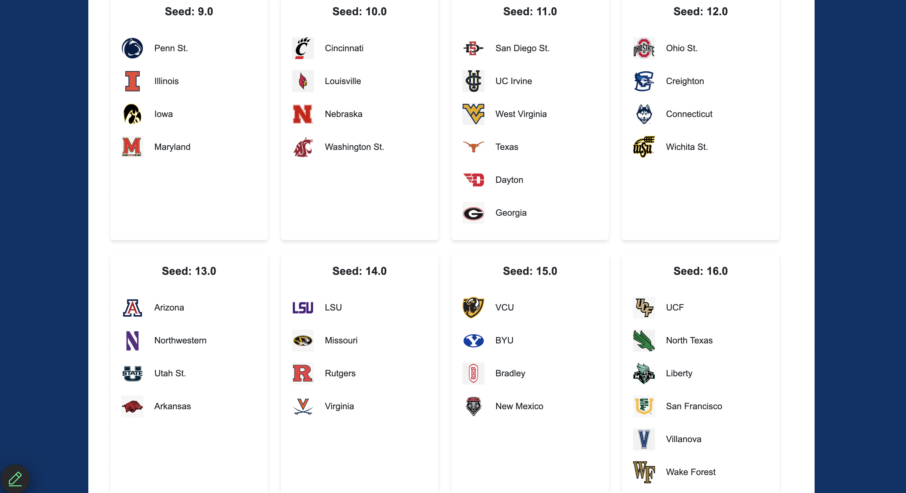

# NCAA Basketball Tournament Prediction Project 

[](https://github.com/danishmaknojia/Final_Project_DE/actions/workflows/flask.yml)

[](https://github.com/danishmaknojia/Final_Project_DE/actions/workflows/data_pipeline.yml)

## Youtube Video
[click here](https://youtu.be/viAeG9t9qAU?si=DZ7B4uvm4PkOSFAm)

## Algorithmic Approach

This repository contains two interconnected projects focused on predicting NCAA basketball tournament outcomes:

1. **Tournament Seed Prediction** - Predicts NCAA tournament seeds using machine learning models trained on historical data and produces live updates.
2. **Postseason Outcome Prediction** - Assigns predicted postseason outcomes (e.g., Champion, Runner-Up) to NCAA teams based on performance metrics.

### **1. NCAA Basketball Tournament Seed Prediction**

#### **Overview**
We initially aim to predict NCAA basketball tournament seeds using historical data and team performance metrics. It dynamically ranks teams and predicts their seeds for our live dataset.

#### **Features**
- **Historical Data Modeling:** Trains a Generalized Additive Model (GAM) on past team metrics and their tournament seeds.
- **Performance Evaluation:** Validates the model using Mean Absolute Error (MAE).
- **Dynamic Team Ranking:** Assigns NCAA tournament seeds to the top 68 teams based on their performance scores.

#### **Data Sources**
- **Historical Data:**
  - `train_data.csv` (for training).
  - `test_data.csv` (for validation).
- **Live Data:** Scraped from Bart Torvik, containing up-to-date team performance metrics.

### How It Works

1. **Prepare the Data:**
   - The first step is to load the datasets. We begin with the `train_data.csv` file, which contains historical team performance data up until the 2023 season. This data includes various metrics like offensive and defensive efficiency (e.g., ADJOE, ADJDE), rebound percentages, turnover rates, and more, that are essential for evaluating team performance.
   - The `test_data.csv` file contains data for the 2023-2024 season. This will serve as the validation dataset to assess how well our model performs on unseen data, simulating how the model will perform for the current and future seasons.

2. **Train the Model:**
   - We use the historical data (`train_data.csv`) to train the Generalized Additive Model (GAM). The GAM learns the relationship between the team performance metrics and the corresponding tournament seeds. 
   - The training data is split into training and validation subsets, and the model is trained using the training data. This enables the model to understand how various features (such as team metrics) influence the seed assignments in the NCAA tournament. 

3. **Validate the Model:**
   - Once the model is trained, we validate it using the `test_data.csv` file, which contains data from the 2023-2024 season. This step is crucial because it provides a way to assess how well the model generalizes to unseen data and makes predictions for new tournament seasons.
   - During validation, the model predicts the NCAA tournament seeds for the teams in the 2023-2024 season. By comparing these predicted seeds with the actual seeds assigned in the 2023-2024 tournament, we can evaluate the accuracy of the model using metrics like Mean Absolute Error (MAE).

4. **Predict Seeds for 2024-2025 Season:**
   - After confirming that the model performs well on the 2023-2024 validation set and is accurate enough, we use the trained and validated model to predict the seeds for the upcoming 2024-2025 season.
   - To do this, we scrape live team performance data for the 2024-2025 season from sources like Bart Torvik. The scraped data includes current metrics such as offensive and defensive ratings, rebound and turnover percentages, etc. These features are used as input for the trained model.
   - The model then generates predictions for the top 68 teams in the 2024-2025 season, assigning them the predicted NCAA tournament seeds based on their performance metrics.

5. **Evaluate Accuracy:**
   - After making predictions for the 2024-2025 season, we evaluate the model's performance by checking how closely the predicted seeds align with actual outcomes (based on ESPN projections).

6. **Dynamic Updates:**
   - In addition to initial predictions, the model can be continuously updated with live data throughout the 2024-2025 season. As new team performance data is scraped, the model can generate updated predictions for the NCAA tournament seeds, allowing real-time forecasting for the ongoing season.

This process ensures that the model first learns from historical data, is validated using recent season data, and is then capable of making accurate predictions for the upcoming season. The model is built to be updated dynamically, providing reliable seed predictions for the 2024-2025 season and beyond.

---

### **2. NCAA Basketball Postseason Outcome Prediction**

#### **Overview**
Once we have obtain the postseason seeds for our teams we decide to work on predicting how march madness will pan out i.e. who will be win it all, which teams will make the final four, elight eight and so on. This element of the project uses a Random Forest Classifier to predict postseason outcomes for NCAA basketball teams based on performance metrics.

### **How It Works**
1. **Data Preprocessing:**
   - **Encoding `POSTSEASON` Outcomes:** The `POSTSEASON` column, which contains categorical values representing teams' outcomes in the NCAA tournament (e.g., Champion, Runner-Up, Final Four), is transformed into numerical labels using `LabelEncoder`. This step allows the model to work with numerical data for machine learning tasks.
   - **Filtering Data:** Only teams that have participated in postseason play are kept, ensuring that the model is trained on relevant data where postseason outcomes are known.
2. **Model Training:**
   - **Feature Selection:** The Random Forest Classifier is trained on a set of important features that reflect team performance, such as offensive efficiency (`ADJOE`), defensive efficiency (`ADJDE`), and other metrics like `TOR` (Turnover Rate) and `EFG_O` (Effective Field Goal Percentage for offense).
   - **Training the Model:** Using these features, the model learns the patterns that link team performance metrics to postseason outcomes (e.g., reaching the Final Four or winning the Championship). The Random Forest algorithm, known for its ability to handle complex data relationships, builds multiple decision trees and aggregates their predictions for improved accuracy.
3. **Outcome Assignment:**
   - **Predicting Probabilities:** Once trained, the model is used to predict the postseason probabilities for teams in the current live dataset. The model outputs a probability distribution across different postseason outcomes (e.g., Champion, Final Four, Sweet Sixteen).
   - **Systematic Label Assignment:** Teams are assigned a postseason outcome based on the predicted probabilities. For example, the model assigns the highest probability label (Champion) to the team with the most likelihood of winning the tournament. The next highest probabilities are assigned to outcomes like Final Four, Elite Eight, etc., following the hierarchical structure of the tournament's progression (Champion > Runner-Up > Final Four > Elite Eight, etc.).
4. **Output Mapping:**
   - **Mapping Numeric Labels to Descriptive Outcomes:** After assigning numerical labels to teams based on predicted postseason rankings, these labels are mapped back to their descriptive postseason outcomes using a dictionary. This ensures the final output is easily interpretable, with teams having a clear classification like "Champion," "Elite Eight," or "Round of 64."

### Conclusion:

Together, these interconnected projects offer a comprehensive tool for predicting both tournament seeding and outcomes, continuously refined with live data to provide real-time insights. This approach not only enhances the accuracy of predictions but also offers a dynamic system capable of adapting to new data and providing updated forecasts throughout the tournament season.

---

# March Madness Predictor Flask App

## Features

### **Homepage**
- Upon visiting the homepage, you're greeted with:
  - **Overall Top Seed:** The team projected to be the No. 1 overall seed for the tournament.
  - **Teams on the Edge:** A list of teams currently just scrpaing through to make it to March Madness.


### **Seed Projections**
- Scrolling down reveals the **projected seedings** for every team in the tournament:
  - Seeds **1 through 10**: Each seed is assigned four teams.
  - Seeds **11 and 16**: These have **six teams** each, accounting for play-in games.




### **League Representation**
- Further down, you'll find a **league breakdown**, displaying how many teams are projected to make the tournament from each conference, including:
  - Big Ten
  - SEC
  - ACC
  - And more...


### **Prediction Page**
- Clicking the **Predict Button** takes you to a dedicated prediction page:
  - **Final Four Teams**: See which four teams are projected to reach the Final Four.
  - **Runner-Up and Champion**: View predictions for the runner-up and the tournament champion.


### **Team Statistics**
- Hover over any of the Final Four teams to reveal detailed statistics about their playstyle, including:
  - **ADJOE (Adjusted Offensive Efficiency)**: Offensive effectiveness.
  - **ADJDE (Adjusted Defensive Efficiency)**: Defensive performance.
  - **TO (Turnover Rate)**: Team's tendency to commit turnovers.
  - **DTO (Defensive Turnover Rate)**: Ability to force turnovers from opponents.
  - **RB (Rebound Rate)**: Overall rebounding efficiency.
  - **DRB (Defensive Rebound Rate)**: Success at securing defensive rebounds.
  - And more...


---

## **Microservice**

### Architectural Diagram


### Purpose
The microservices provide reusable Python functions for:
- Data preprocessing and splitting.
- Machine learning model training and prediction for tournament seeding.
- Ranking teams and assigning tournament seeds.
- Predicting postseason performance and mapping results.

### Key Functionalities

- **`data_split_to_feature_outcome`**: 
  Splits a dataset into features (X) and outcomes (y) for modeling, ensuring the outcome is appropriately cast.

- **`model_execution`**: 
  - Trains a Generalized Additive Model (GAM) to predict NCAA tournament seeds based on basketball statistics.
  - Outputs the predicted seeds as a numerical score.
  - Scales data using `StandardScaler`.
  - Evaluates performance using Mean Absolute Error (MAE).

- **`rank_teams_produce_top_68`**: 
  Ranks teams based on their seed scores and assigns seeds to the top 68 teams, respecting NCAA seeding rules.

- **`postseason_result`**: 
  Trains a Random Forest Classifier to predict the postseason stage for teams based on features and assigns probabilities to possible outcomes.

- **`post_season_mapping`**: 
  Maps numerical labels back to descriptive postseason outcomes (e.g., "Champion", "Elite Eight").

#### Data Extraction Services
- **`extract_bart_torvik_data`**: Scrapes Bart Torvik’s website for live basketball data and processes it into a structured format.

#### AWS S3 Utility Services
- **`upload_to_s3`**, **`read_s3_csv`**, **`write_s3_csv`**: Handle file operations (upload, download, and writing) with AWS S3.


---

## **Data Engineering**

### Purpose
This layer focuses on ingesting, cleaning, transforming, and preparing data for model training and prediction tasks.

### Data flow


### Key Steps

1. **Data Ingestion**:
   - Local files are uploaded to AWS S3 for centralized storage.
   - Files include historical basketball data and cleaned datasets from Bart Torvik.

2. **Data Cleaning and Transformation**:
   - Historical datasets (e.g., `cbb16.csv`) are merged and cleaned with postseason and seed data from related files (e.g., `cbb.csv`).
   - Misnamed columns (e.g., `EFGD_D` to `EFG_D`) are corrected.
   - Missing seed and postseason values are filled using combined data from multiple sources.

3. **Dataset Combination**:
   - Historical datasets are concatenated into a unified training dataset (`train_data.csv`).
   - Current season data is processed separately into a test dataset (`test_data.csv`).

4. **Feature Engineering**:
   - Basketball statistics like `ADJOE`, `ADJDE`, `BARTHAG`, and more are used to create predictive features for tournament seeding and postseason outcomes.
   - Current season data predictions are integrated with live updates from Bart Torvik.

5. **Model Workflow**:
   - **Training**: Features are prepared using the `data_split_to_feature_outcome` function and modeled with GAM for seed prediction and Random Forest for postseason prediction.
   - **Prediction**: Trained models are applied to current data (`current_cbb_live_data.csv`) for the 2024-25 season.

6. **Output Files**:
   - Seeded data (`cbb25_seeded_{date}.csv`) and ranked predictions are generated for analysis.

---

## **Infrastructure as Code (IaC)**

### Purpose
AWS services and other tools are configured programmatically to ensure reproducibility, scalability, and maintainability.

### Key Components

#### Pipeline Automation with Makefile
To ensure seamless execution, the data pipeline is triggered through a Makefile:

```makefile
upload_s3:
    python read_write_files_s3.py
```

#### GitHub Actions Workflow
The pipeline is automated on every push using the following steps:

1. **AWS Credential Configuration**:
   - Utilizes `aws-actions/configure-aws-credentials@v3` to authenticate with AWS.

2. **Makefile Execution**:
   - Triggers `make upload_s3` to process data and upload cleaned files to S3.

#### AWS S3:
- **Centralized Storage**:
  - Raw, processed, and prediction output datasets are stored under organized folders.
  - Input files stored under `Final_Project_DE/archive/`.
  - Processed and prediction files stored under `Final_Project_DE/`.

- **Automation via Python**:
  - Functions automate S3 file operations:
    - **`upload_to_s3`** for uploading local files to S3.
    - **`read_s3_csv`** for reading files into Pandas DataFrames.
    - **`write_s3_csv`** for writing processed datasets back to S3.
  - The pipeline automates merging, cleaning, and generating output files.

- **Log Management**:
  - Logs generated for key operations using Python’s logging library, stored in `data_processing.log`.
  - Tracks data ingestion, model training, predictions, and error handling.

#### Scalability:
- The modular pipeline can process additional seasons or integrate other data sources by simply adding files to the S3 bucket or updating features.

#### Extensibility:
- Current configurations can be integrated with CI/CD pipelines or serverless architectures (e.g., AWS Lambda) for fully automated workflows.

---

## **Load Test and Quantitative Analysis**


## Total Requests Per Second (RPS)

### Metrics
- **Peak RPS**: 130.5 requests per second
- **Failures per Second**: 0.2 failures per second (maximum observed)

#### Observations
- The RPS increased steadily throughout the test, reaching a maximum value of 130.5.
- Failure rates remained consistently low, with a maximum of 0.2 failures per second.

#### Implication
The system processed over 130 requests per second with a failure rate of less than 0.2%, indicating strong reliability under the simulated load.

### Response Times (ms)

#### Metrics
- **50th Percentile Response Time**: 8,100 ms (median)
- **95th Percentile Response Time**: 15,000 ms (slowest 5% of requests)

#### Observations
- The majority of requests were completed within 8,100 ms.
- A small percentage of requests (5%) experienced delays, with response times reaching 15,000 ms.

#### Implication
While the median response time was acceptable, higher percentiles indicate variability in response times under load.

### Number of Users

#### Metrics
- **Maximum Number of Simulated Users**: 10,000 users

#### Observations
- The user count increased steadily, reaching the target of 10,000 concurrent users.
- The system maintained stable performance as the user load grew.

#### Implication
The application successfully handled a concurrent load of 10,000 users without a significant impact on failure rates.

In summary the application handles up to 130 RPS with 10,000 users while maintaining low failure rates. This suggests good scalability for this level of concurrency. We also see that the failure rates is staying close to zero, which indicates that the system demonstrates reliability in handling the simulated load.

---
